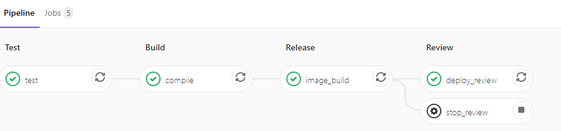
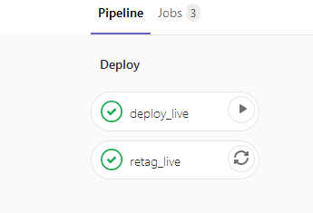

# A simple go app
Demonstrates deploying to a VMware Tanzu Kuberentes cluster on VSphere with Kubernetes with Gitlab CI.
App originally from https://github.com/galexrt/presentation-gitlab-k8s.

## Development flow
To run "dev" pipeline on master edit `main.go` and commit. 
On first run a 'review' namespace will be created to deploy into.
App will create ingress as http://review-master-8dyme2.goapps.my.com/ (See Variables below)

The pipeline looks like this:



**image_build** uses https://github.com/GoogleContainerTools/kaniko to build the image and push it to the "**dev**/go-demo" repository in Harbor. See Kaniko related variables below.

**deploy_review** replaces a number of tokens in the deployment manifests before deploying

## Deployment to "production" flow
On first run a namespace `go-demo-3-live` will be created to deploy into.
App will create ingress as http://live.apps.lab.local/ (See Variables below)

To deploy to the "live" (production) environment create a tag on a commit on master. This will run a pipeline that looks like this:



**retag_live** runs automatically and adds the Git tag to the image in the "**live**/go-demo" repository in Harbor.
**deploy_live** is a manual job that replaces a number of tokens in the deployment manifests before deploying  

# Gitlab CI Variables

Add the following to https://gitlab.my.com/devops/go-demo/-/settings/ci_cd -> Variables

`CI_CUSTOM_CA` : Harbor cert , used by kaniko
	
`CI_REGISTRY` : URL for image registry `https://${CI_REGISTRY_HOST}/`

`CI_REGISTRY_HOST` : Ip or hostname for image registry `192.168.2.3`

`CI_REGISTRY_IMAGE` : used by Kaniko to push and in deployment manifest  eg `${CI_REGISTRY_HOST}/${CI_REGISTRY_PROJ}/dev/${CI_PROJECT_NAME}`
	
`CI_REGISTRY_PASSWORD` : used by curl to tag image in harbor
	
`CI_REGISTRY_PROJ` : Harbor project name == VSphere with Kubernetes Supervisor Cluster Namespace where Tanzu Kuberentes cluster is deployed eg `demo`
	

`CI_REGISTRY_USER` : used by curl to tag image in harbor `devops@vsphere.local`
	

`INGRESS_DOMAIN` : FQDN suffix for ingress eg: `goapps.my.com` . will be prefixed by environment name and needs a wildcard entry in DNS pointing to LB IP 
	
`KUBE_TOKEN` ; Used by kubectl .  
```
kubectl -n kube-system describe secret $(kubectl -n kube-system get secret | grep gitlab-admin | awk '{print $1}') | grep "token:" | awk '{print $2}'
```

